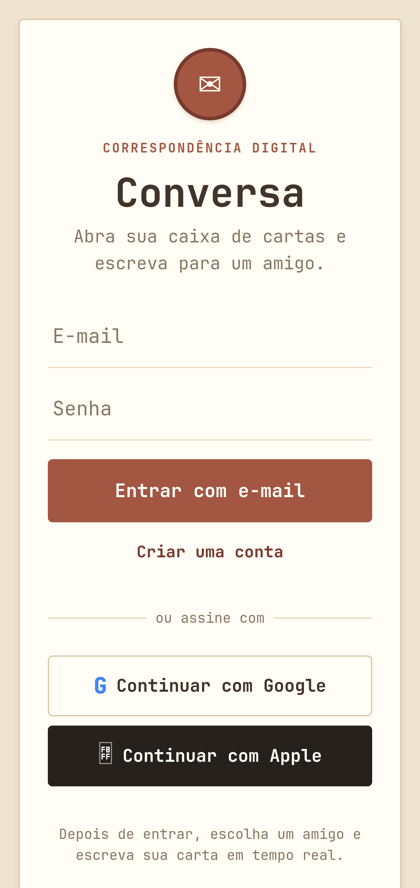
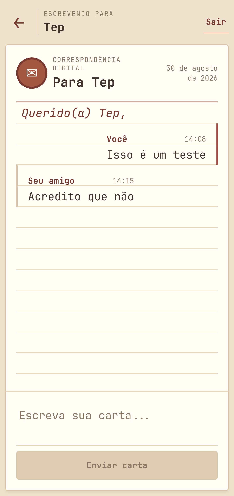

# Conversa

Aplicativo de chat privado 1 para 1 feito para o CheckPoint 1. Usuários autenticados podem conversar em tempo real quando os provedores de autenticação são compatíveis.

## Tecnologias

- React Native
- Expo SDK 55
- TypeScript
- Firebase Authentication
- Firebase Realtime Database
- Expo AuthSession
- Expo Apple Authentication

O projeto usa somente o Firebase Realtime Database para as mensagens. Cloud Firestore não é utilizado.

## Regras do chat

Cada conversa possui exatamente dois participantes. A seleção de contatos segue estas regras:

- E-mail e senha pode conversar com Google ou Apple.
- Google ou Apple pode conversar somente com e-mail e senha.
- O usuário não aparece como contato próprio.
- Mensagens são persistidas em `messages/{conversationId}` e a tela acompanha as alterações com um listener do Realtime Database.

## Executar o projeto

1. Instale o Node.js e o npm.
2. Instale as dependências:

   ```bash
   npm install
   ```

3. Copie o arquivo de ambiente:

   ```bash
   cp .env.example .env
   ```

4. Preencha o `.env` com os dados do aplicativo web do Firebase e os client IDs OAuth.
5. Inicie o Expo:

   ```bash
   npx expo start
   ```

Comandos disponíveis:

```bash
npm run android
npm run ios
npm run web
npm run typecheck
```

O login por e-mail pode ser testado no Expo Go e na Web. Para testar Google e Apple em um app nativo, prefira um development build, porque o Expo Go não permite personalizar o scheme OAuth. Depois de configurar os IDs, use `npx expo run:ios`, `npx expo run:android` ou um build de desenvolvimento do EAS.

## Configuração do Firebase

1. Crie um projeto no [Firebase Console](https://console.firebase.google.com/).
2. Adicione um aplicativo Web e copie os valores da configuração para o `.env`.
3. Em Authentication, habilite:
   - E-mail/senha
   - Google
   - Apple
4. Crie um Realtime Database e escolha o modo adequado para o projeto.
5. Publique as regras deste repositório:

   ```bash
   firebase login
   firebase use SEU_PROJECT_ID
   firebase deploy --only database,hosting
   ```

Nunca publique regras abertas com `.read: true` e `.write: true`.

### Google

Ative o Google no Firebase Authentication. No Web, o aplicativo usa o popup do Firebase, então não é necessário cadastrar um redirect local do Expo. Adicione o domínio usado pelo app em Authentication > Settings > Authorized domains, se ele ainda não estiver listado.

Crie os clientes OAuth para Web, iOS e Android no Google Cloud Console. Coloque os três IDs nas variáveis `EXPO_PUBLIC_GOOGLE_*_CLIENT_ID`. O Web ID é usado como referência para o fluxo web e os IDs nativos são usados pelo `expo-auth-session` em builds nativos.

Para builds nativos, o `scheme` definido no `app.json` é `cp1chat`. Depois de alterar bundle identifier, package ou scheme, gere um novo build nativo.

### Apple

No iOS, habilite a capability Sign in with Apple para o bundle identifier `com.example.cp1chat`. O login nativo usa `expo-apple-authentication` e precisa de um build iOS configurado no Apple Developer.

Na Web, o projeto usa o fluxo OAuth da Apple. No Android, o fallback usa a página `public/apple-auth.html`, que deve ser publicada no Firebase Hosting. Configure `EXPO_PUBLIC_APPLE_REDIRECT_URI` com o endereço HTTPS dessa página, por exemplo `https://SEU_PROJECT_ID.web.app/apple-auth.html`, e cadastre o mesmo endereço no Apple Developer. A página repassa a resposta para o scheme `cp1chat://auth`. Um endereço `cp1chat://` direto não substitui o redirect HTTPS exigido pelo Service ID. Publique a página com `firebase deploy --only hosting`. A chave privada da Apple, o Team ID e o Key ID ficam somente na configuração do provedor no Firebase ou no servidor. Eles nunca devem ser colocados no aplicativo.

Os redirects precisam ser cadastrados exatamente como forem gerados pelo ambiente em que o app será executado. Para produção Web, use o domínio final da aplicação.

## Estrutura

```text
src/
  components/       Componentes reutilizáveis de interface
  config/           Inicialização do Firebase por plataforma
  contexts/         Estado global da autenticação
  hooks/            Fluxos OAuth do Google e da Apple
  screens/          Login, contatos e chat
  services/         Authentication, usuários e Realtime Database
  types/            Tipos de usuário e conversa
  utils/            Regras de compatibilidade, parsers e erros

database.rules.json Regras de segurança do Realtime Database
firebase.json       Configuração para publicar as regras
```

## Estrutura dos dados

```text
users/{uid}
  uid
  name
  email
  provider
  photoURL
  createdAt
  updatedAt

conversations/{conversationId}
  participantOne
  participantTwo
  createdAt
  updatedAt

usersByProvider/{provider}/{uid}
  uid
  name
  email
  provider
  photoURL
  createdAt
  updatedAt

messages/{conversationId}/{messageId}
  id
  conversationId
  senderId
  receiverId
  text
  createdAt
```

## Prints da aplicação

Adicione os prints reais antes da entrega:






## Integrantes

Os nomes e RMs informados para a equipe são:

- RM554962 - Guilherme
- RM555556 - Pedro
- RM558216 - Fabrício
- RM554893 - Vitor
- RM555447 - Matheus

## Entrega

Envie somente o link deste repositório no GitHub, na tarefa **CheckPoint 1 - Chat** do Microsoft Teams.
